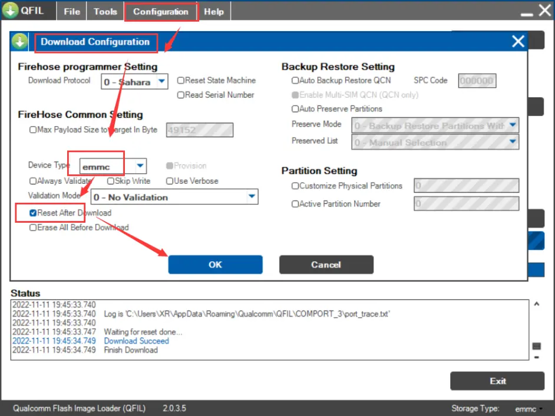
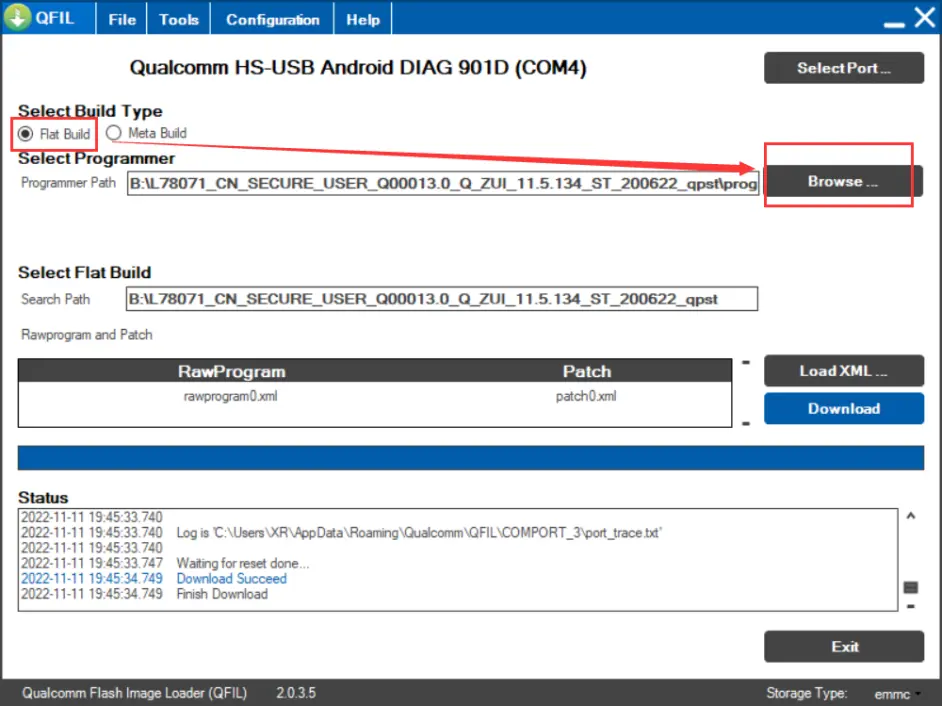
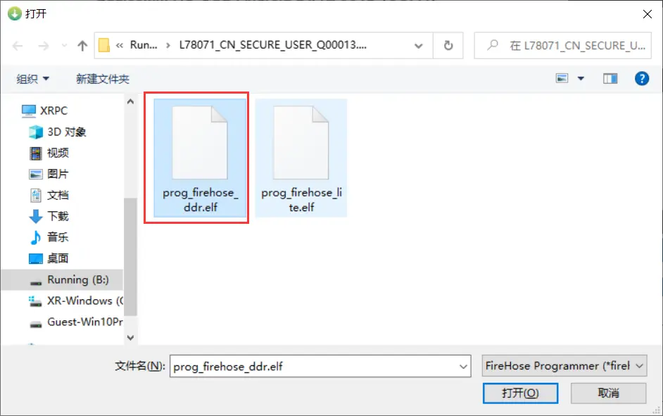
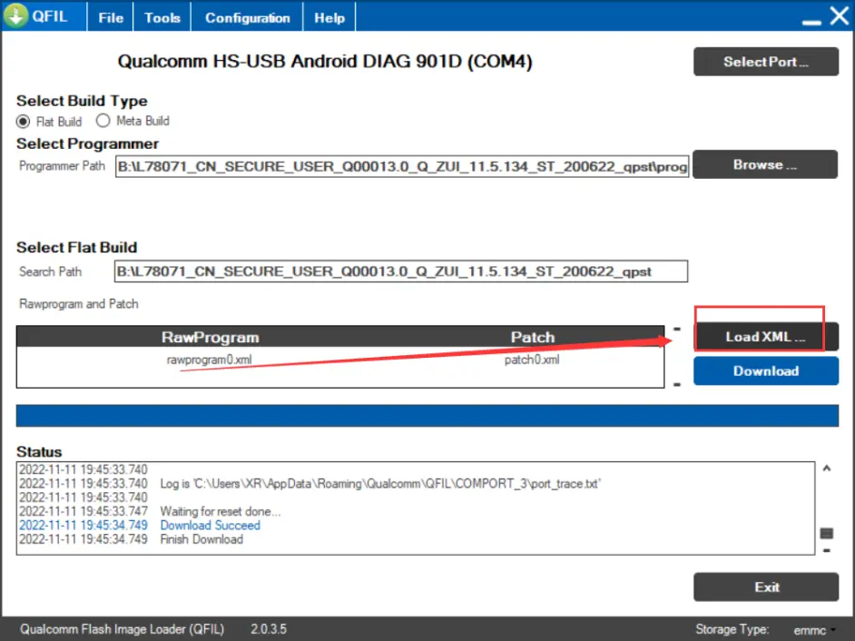
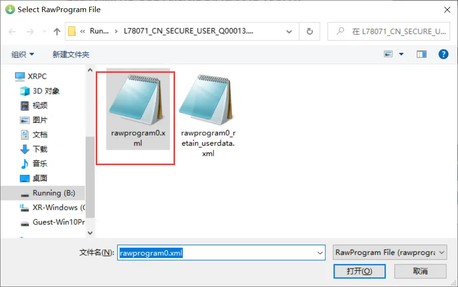
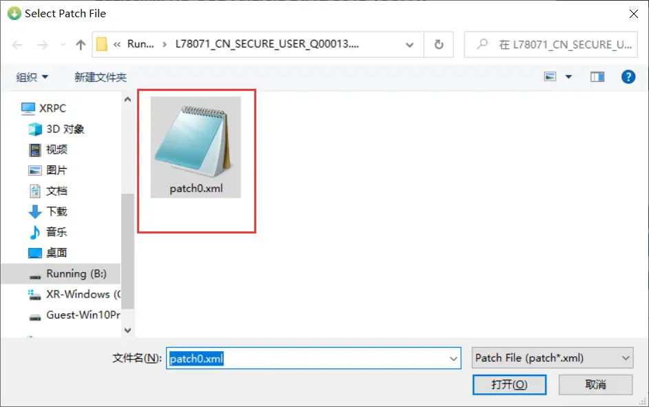
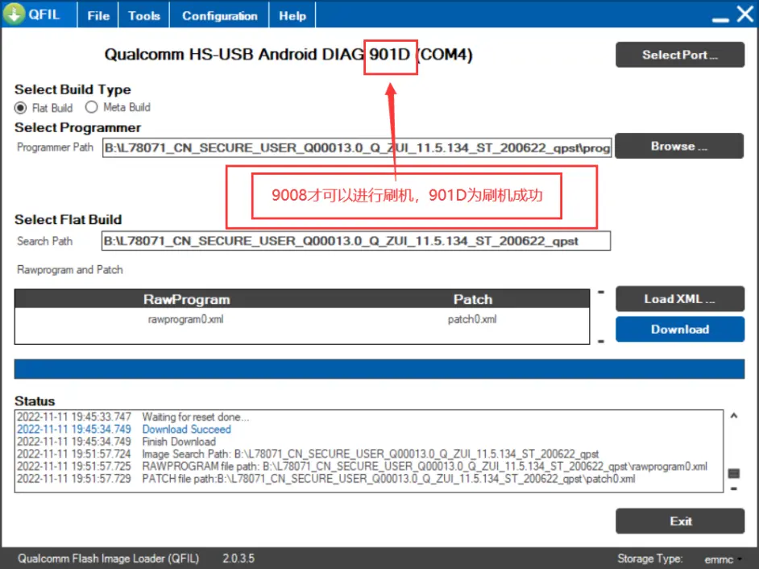

## 1.安装QFIT 和 安装驱动

QFIT：[前往下载 QFIT](href="https://qfiltool.com)  [本地文件](./Tools/Qualcomm_Flash_Image_Loader_v2.0.3.5.zip)

驱动（测试可用）：[前往下载 9008驱动](https://www.drvsky.com/driver/Qualcomm_HS-USB_Driver.htm)  [本地文件](./Tools/qualcomm_hs-usb_driver.exe)

或下载Tools里的工具

## 2.进入9008模式

同时按住 电源键+音量加+音量减 大概10秒，屏幕会显示图标然后熄屏，此时再插入 usb线缆

## 3.选择 emmc 方式

## 4.选择 Flat Build 浏览已解压的 rom 目录，选择 prog_firehose_ddr.elf 文件

## 5.加载 rawprogram0.xml 和 patch0.xml 文件

## 6.确认是否为 9008 模式

> 901D为刷机成功状态
>
> 在此状态刷机会出现错误 ：Switch To EDL Fail Failed to Switch to Emergency Download mode 

