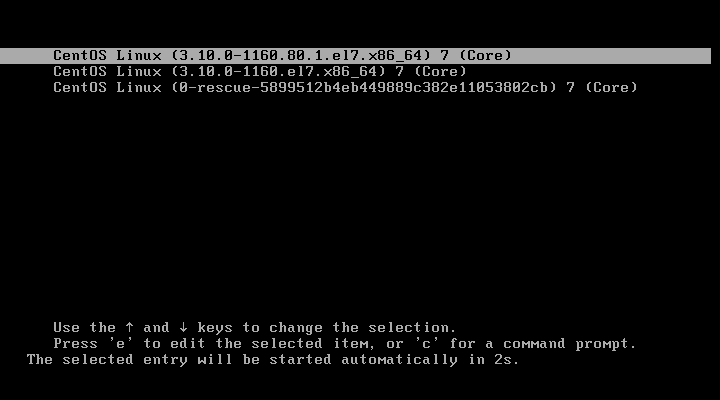

## 1.重启CentOS系统，到系统选择界面



## 2.按下`e`键，进入Grub编辑页面


## 3.往下翻，找到 **crashkernel** 字样

将 **crashkernel** 前的 ==ro== 修改为以下内容

```shell
rw init = /sysroot/bin/sh
```


## 4.按下 `Ctrl+X` 启动

如果配置错误，可以按下 `Ctrl+C` 取消保存并退出


此时进入了emergency mode


## 5.修改 root 密码

```shell
# 1.切换至系统根目录
chroot /sysroot
# 2.修改密码
passwd
# 3.应用 root 密码
touch /.autorelabel
# 4.退出编辑
exit
# 5.重启系统，可能会多次重启，等待最终进入系统即可
reboot
```

