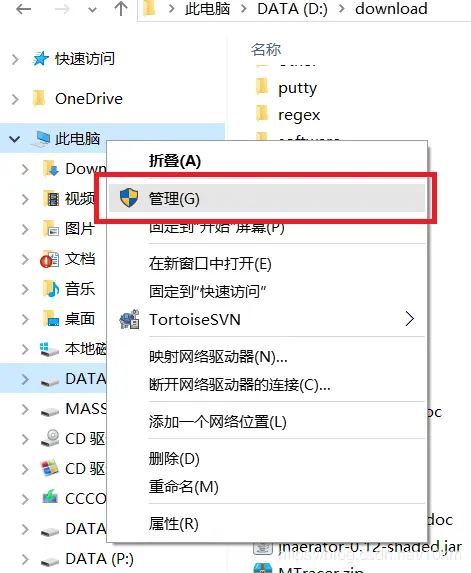
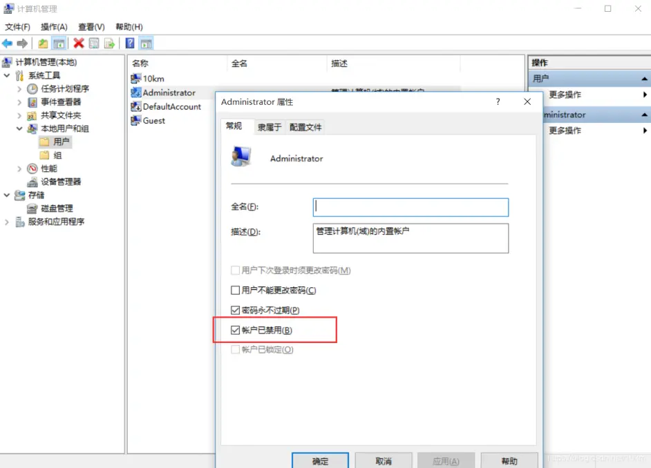
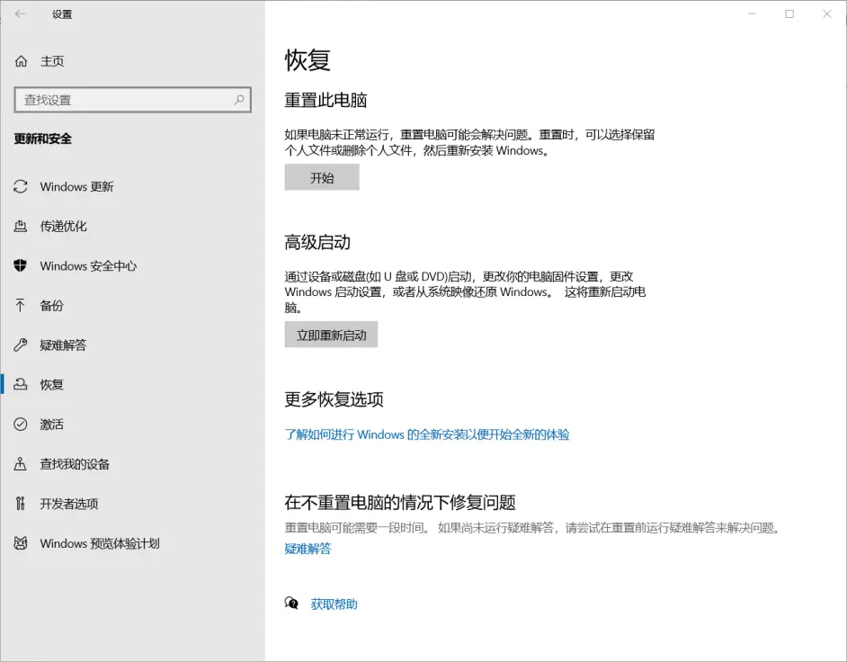
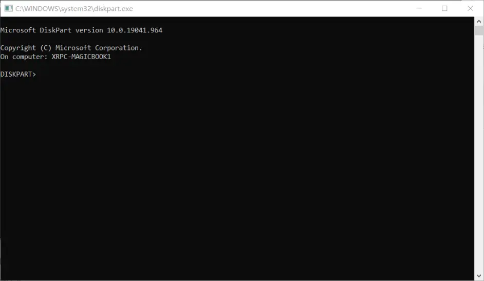
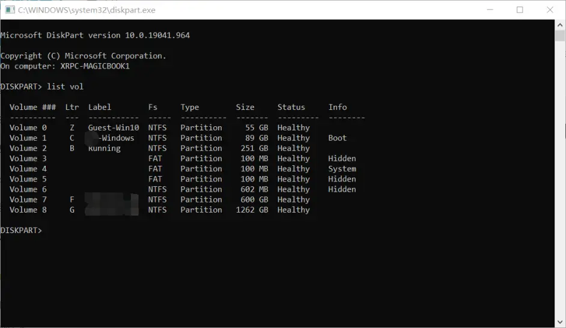
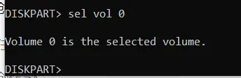
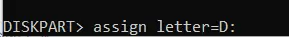
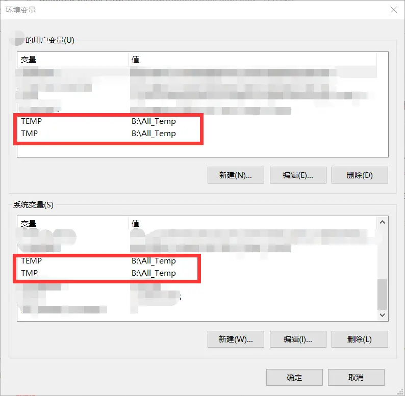

## 概述

参考文章：https://juejin.cn/post/7025763363883876382

C盘除软件本体外，占用空间的主要为软件缓存【Users为文件夹】与临时文件

瘦身原理就是把这些文件夹迁移到其他盘，在通过软链接来维持原本功能【可以用于软件安装前后】

# 一、迁移缓存

## 1.开启Administrator账户





## 2.通过高级启动，打开命令提示符，按下列指令操作

> 或者通过启动U盘的Windows修复模式进入命令提示符



## 3.设置盘符

> 如果分区出现盘符错乱，例如：C:\ 变为 D:\
>
> 可以通过以下指令将对应分区的盘符进行修改（D:\ 改为 C:\）

```powershell
# 进入磁盘编辑
diskpart
# 查看分区列表
list vol
# 选择分区
sel vol 分区号
# 分配盘符
assgin letter=盘符:
# 退出磁盘编辑
exit
# 打开新的cmd窗口
start cmd
```









## 4.迁移缓存文件夹

```powershell
# 切换到系统盘，本文系统盘为C:\
c:
# 迁移C盘文件夹，复制 C:\Users 到 D:\Users
robocopy "C:\Users" "D:\Users" /E /COPYALL /XJ /XD "C:\Users\Administrator"
# 删除C盘的 Users文件夹，注意文件完整性，以及进行文件备份
rmdir "C:\Users" /S /Q
# 创建软链接
mklink /J "C:\Users" "D:\Users"
```

## 5.重启电脑

至此，Users文件夹的N个G就清出来了 


---

## ==6.恢复原状==

```powershell
# 删除软连接
rmdir C:\Users
```

再将 Users 文件夹复制到原来的路径下即可

# 二、修改缓存路径

修改临时文件路径

1. 打开环境变量

2. 将用户与系统的 TEMP 与 TMP 变量的路径都进行修改

   